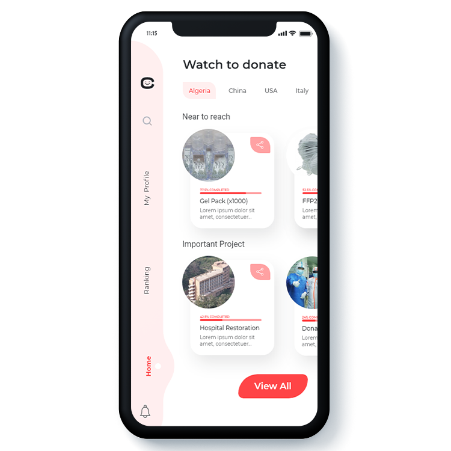

# Carety
> Flutter project
>«Carety» est une application mobile offrant à l'utilisateur la possibilité de visualiser plusieurs vidéos de publicités provenant d'entreprises produites dans l'économie numérique afin de renforcer la commercialisation des produits rencontrant des difficultés durant cette pandémie tout en assolant r pour lutter contre le covid 19. 

## Installation

- Not yet

## Preview
### Landing_Page 

### Main_Page

## Authors
- Iheb Nassim Aouadj
- Ala Eddine Nasri
- Ahmed Zaki Bennecer
- Billel Benoudjit 

## Contributions

Pull requests are welcome. For major changes, please open an issue first to discuss what you would like to change.

Please make sure to update tests as appropriate.
